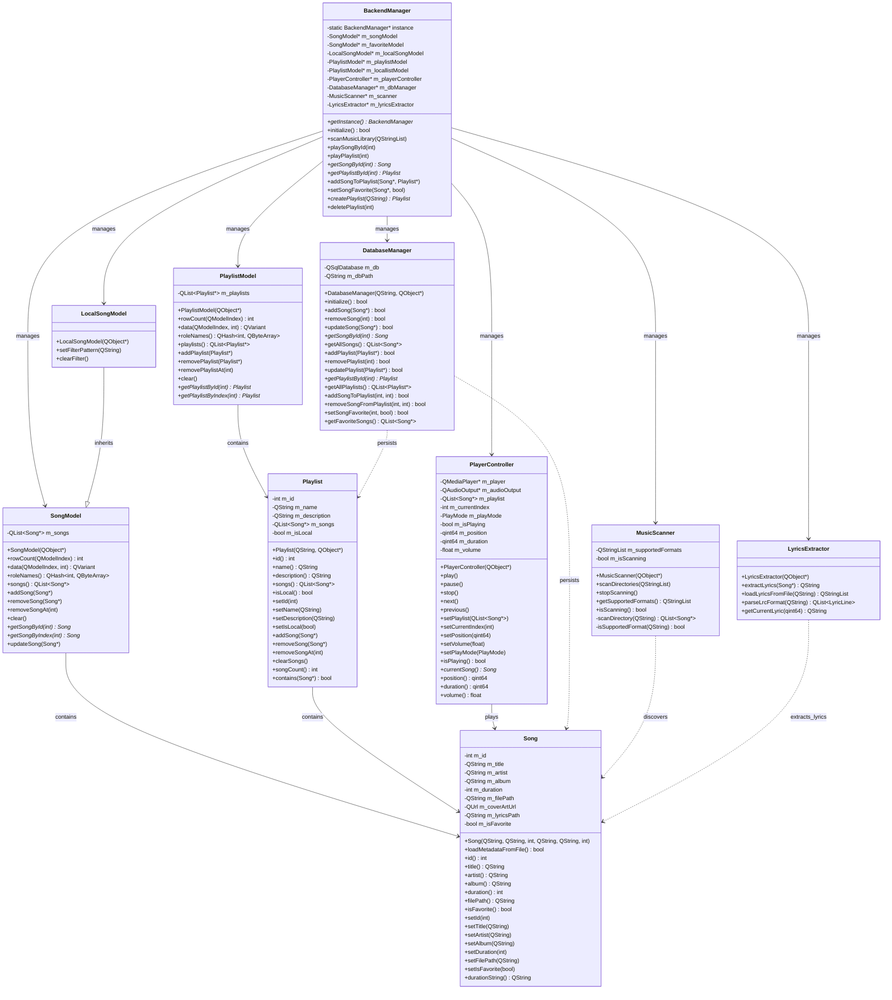
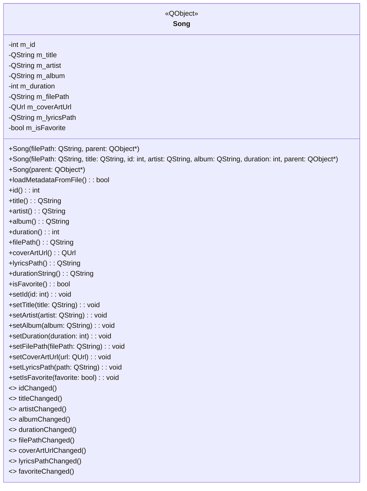
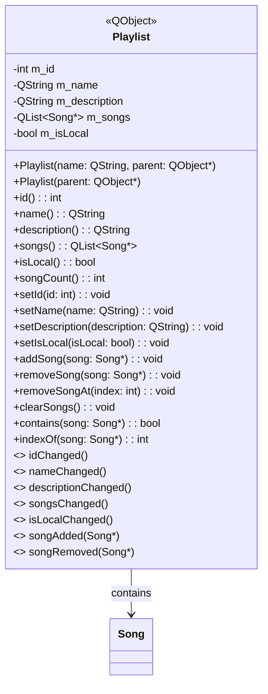
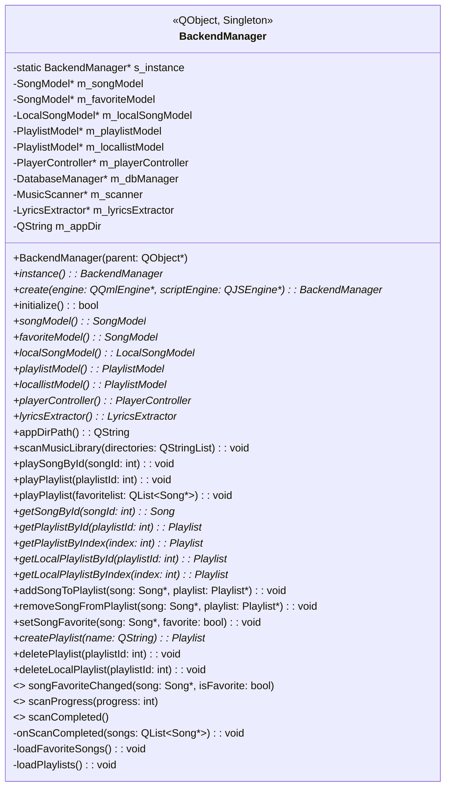
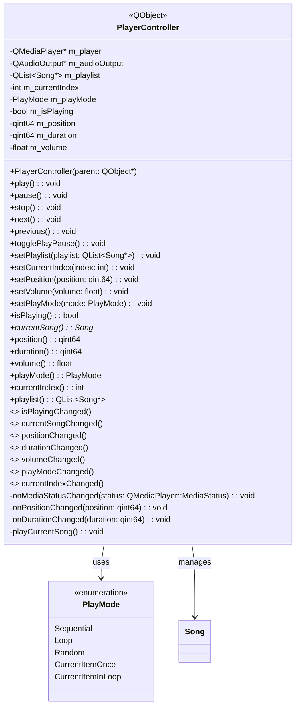
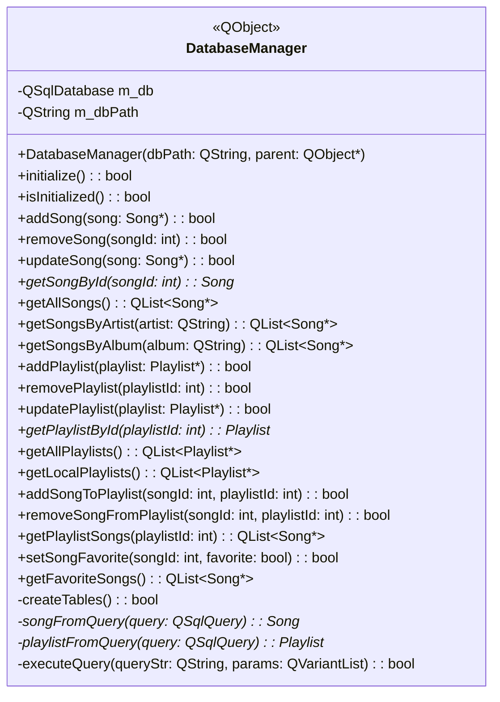
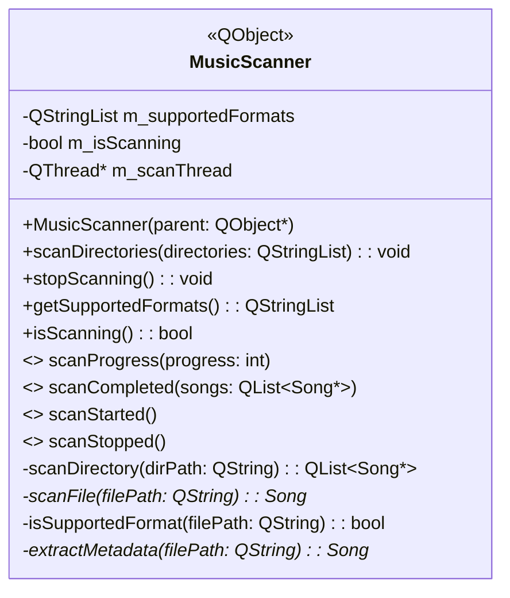
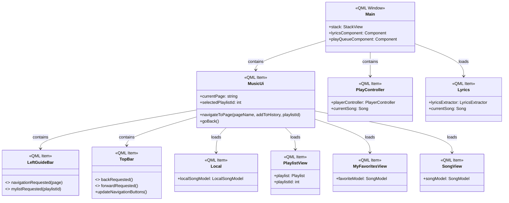

# QML Music Player - UML类建模文档

## 1. 系统架构概览

QML Music Player采用分层架构设计，主要分为表示层(QML UI)、业务逻辑层(C++ Backend)和数据访问层(SQLite Database)。

## 2. 核心类设计

### 2.1 整体类关系图

### 2.2 数据模型类详细设计

#### 2.2.1 Song类设计

#### 2.2.2 Playlist类设计

### 2.3 业务逻辑层类设计

#### 2.3.1 BackendManager类设计

#### 2.3.2 PlayerController类设计

### 2.4 数据访问层类设计

#### 2.4.1 DatabaseManager类设计

#### 2.4.2 MusicScanner类设计

### 2.5 QML界面组件设计

#### 2.5.1 主要QML组件关系

## 3. 设计模式应用

### 3.1 单例模式 (Singleton Pattern)

- **应用类**: `BackendManager`
- **目的**: 确保整个应用只有一个后端管理器实例，提供全局访问点
- **实现**: 静态实例变量 + 私有构造函数 + 公共getInstance方法

### 3.2 模型-视图模式 (Model-View Pattern)

- **应用类**: `SongModel`, `PlaylistModel`, `LocalSongModel`
- **目的**: 分离数据模型和UI视图，支持数据绑定和自动更新
- **实现**: 继承QAbstractListModel，实现Qt的模型-视图框架

### 3.3 观察者模式 (Observer Pattern)

- **应用**: Qt信号-槽机制
- **目的**: 实现组件间的松耦合通信
- **实现**: Q_SIGNAL和Q_SLOT宏，connect函数连接

### 3.4 外观模式 (Facade Pattern)

- **应用类**: `BackendManager`  
- **目的**: 为复杂的后端子系统提供统一的简化接口
- **实现**: BackendManager封装所有子模块，QML只需与其交互

### 3.5 策略模式 (Strategy Pattern)

- **应用**: 播放模式切换
- **目的**: 动态切换不同的播放策略(顺序、随机、循环等)
- **实现**: PlayMode枚举 + PlayerController中的策略切换逻辑

---